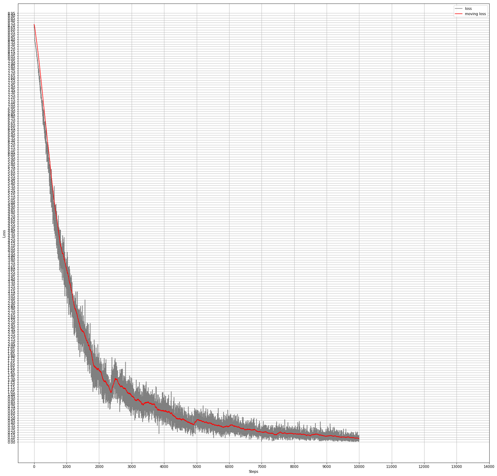

# mfgan
Implementation of MFGAN: Sequential Recommendation with Self-Attentive Multi-Adversarial Network

This is a work in progress. It trains. I have not validatd all of this and have not built evaluation. 

article: https://arxiv.org/abs/2005.10602

Other papers:

Self-Attentive Sequential Recommendation:

https://arxiv.org/abs/1808.09781

Steam dataset is from SASRec.

Description:

This is recommender system, GAN based. It predicts next item user would be interested in.

Discriminator judges generator suggestions based on factors associated with item such as price, sentiments, etc. and sends feedback signal to improve generator.

Training sequence is in the article:

- pretrain generator on MLE
- generate samples with this generator
- pretrain discriminator on binary cross entropy
- train generator and discriminator in a loop

TO-DO and notices:

- I don't get it why input sequence should be right aligned, why not to mask if input sequence is short
- Build evaluation
- I don't like how it converges! See graths.

Training steps:

1. Download Steam dataset. See SASRec paper. 

2. Prepare tfrecords train and test data

python prepare_data.py --activity=steam_reviews.json --tfrecords_file=gs://recsys_container/mfgan/data/train.tfrecords

Algorithm does k-core. k=5

Outputs that used in training - these are factors:

- num_sentiment(popularity) 19
- num_price 6
- num_developer 6765
- num_items 10482

I didn't use category yet.

For now, I am attching factors and whole products(items) table for each tfrecord. Factors can be all fetched from products table when feeding discriminator. But for inference only, factors are not needed, so maybe this layout is actually good.

3. Pretrain generator on MLE

Parameter max interaction sequence length and number of items are defaults for parameters so I am not specifying it in the command line.

python training.py --batch_size=128 --save_checkpoints_steps=1000 --action=TRAIN --training_task=pretrain-generator --learning_rate=0.0002 --train_file=gs://recsys_container/mfgan/data/train.tfrecords --keep_checkpoint_max=200 --factor_bin_sizes=19,6,6765 --output_dir='gs://recsys_container/mfgan/output/pretrain-generator' --num_train_steps=10000

4. Generate samples with generator

python training.py --batch_size=128 --action=PREDICT --prediction_task=generate_samples --test_file=gs://anomaly_detection/mtad_gat/data/train.tfrecords --output_file=gs://anomaly_detection/mtad_gat/data/samples.tfrecords --factor_bin_sizes=19,6,6765 --output_dir='gs://recsys_container/mfgan/output/pretrain-generator'

5. Pretrain discriminator on binary cross entropy

python training.py --batch_size=16 --save_checkpoints_steps=1000 --action=TRAIN --training_task=pretrain-discriminator --learning_rate=0.0002 --train_file=gs://anomaly_detection/mtad_gat/data/train.tfrecords,gs://anomaly_detection/mtad_gat/data/samples.tfrecords --keep_checkpoint_max=200 --factor_bin_sizes=19,6,6765 --output_dir='gs://recsys_container/mfgan/output/pretrain-discriminator' --init_checkpoint='gs://recsys_container/mfgan/output/pretrain-generator' --num_train_steps=38000

6. Train generator and discriminator for N steps. I just put commands for step 0,1,2 until converge

step 0
python training.py --batch_size=128 --save_checkpoints_steps=1000 --action=TRAIN --training_task=gan-generator --learning_rate=0.0002 --train_file=gs://recsys_container/mfgan/data/train.tfrecords --keep_checkpoint_max=200 --factor_bin_sizes=19,6,6765 --output_dir='gs://recsys_container/mfgan/output/gan-generator-0' --init_checkpoint='gs://recsys_container/mfgan/output/pretrain-discriminator' --num_train_steps=508500
python training.py --batch_size=16 --save_checkpoints_steps=1000 --action=TRAIN --training_task=gan-discriminator --learning_rate=0.0002 --train_file=gs://recsys_container/mfgan/data/train.tfrecords --keep_checkpoint_max=200 --factor_bin_sizes=19,6,6765 --output_dir='gs://recsys_container/mfgan/output/gan-discriminator-0' --init_checkpoint='gs://recsys_container/mfgan/output/gan-generator-0' --num_train_steps=40682

step 1
python training.py --batch_size=128 --save_checkpoints_steps=1000 --action=TRAIN --training_task=gan-generator --learning_rate=0.0002 --train_file=gs://recsys_container/mfgan/data/train.tfrecords --keep_checkpoint_max=200 --factor_bin_sizes=19,6,6765 --output_dir='gs://recsys_container/mfgan/output/gan-generator-1' --init_checkpoint='gs://recsys_container/mfgan/output/gan-discriminator-0' --num_train_steps=508500
time python training.py --batch_size=16 --save_checkpoints_steps=1000 --action=TRAIN --training_task=gan-discriminator --learning_rate=0.0002 --train_file=gs://recsys_container/mfgan/data/train.tfrecords --keep_checkpoint_max=200 --factor_bin_sizes=19,6,6765 --output_dir='gs://recsys_container/mfgan/output/gan-discriminator-1' --init_checkpoint='gs://recsys_container/mfgan/output/gan-generator-1' --num_train_steps=40682 

step 2
python training.py --batch_size=128 --save_checkpoints_steps=1000 --action=TRAIN --training_task=gan-generator --learning_rate=0.0002 --train_file=gs://recsys_container/mfgan/data/train.tfrecords --keep_checkpoint_max=200 --factor_bin_sizes=19,6,6765 --output_dir='gs://recsys_container/mfgan/output/gan-generator-2' --init_checkpoint='gs://recsys_container/mfgan/output/gan-discriminator-1' --num_train_steps=508500
python training.py --batch_size=16 --save_checkpoints_steps=1000 --action=TRAIN --training_task=gan-discriminator --clip_gradients=1.0 --learning_rate=0.0002 --train_file=gs://recsys_container/mfgan/data/train.tfrecords --keep_checkpoint_max=200 --factor_bin_sizes=19,6,6765 --output_dir='gs://recsys_container/mfgan/output/gan-discriminator-2' --init_checkpoint='gs://recsys_container/mfgan/output/gan-generator-2' --num_train_steps=40682
