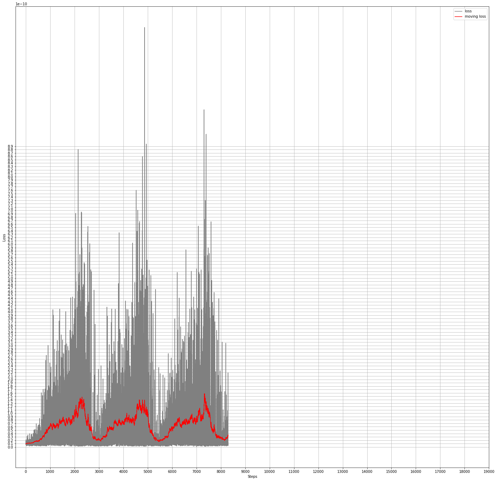

# mfgan
Implementation of MFGAN: Sequential Recommendation with Self-Attentive Multi-Adversarial Network

This is a work in progress. See TO-DO/Notes section.

article: https://arxiv.org/abs/2005.10602

Other papers:

Self-Attentive Sequential Recommendation:

https://arxiv.org/abs/1808.09781

Steam dataset is from SASRec.

Description:

This is recommender system, GAN based. It predicts next item user would be interested in.

Discriminator judges generator suggestions based on factors associated with item such as price, sentiments, etc. and sends feedback signal to improve generator.

Training sequence is in the article:

- pretrain generator on MLE
- generate samples with this generator
- pretrain discriminator on binary cross entropy
- train generator and discriminator in a loop

TO-DO and notices:

- I don't get it why input sequence should be right aligned, why not to mask if input sequence is short
- Training epochs in the article do not much how long it actually takes to converge. It is much less
- Accuracy from Evaluation is very high 0.994343. I think one of the things that training and evaluation are intersect. We use a item one before the last for training purpose and we use the very last for evaluation. I saw in other papers, sets are completely separate. Also, we are just prediction a next item, instead I saw somewhere that several items can be predicted in sequense which will increae challenge. 
- TO-DO: Build a prediction output

Training steps:

1. Download Steam dataset. See SASRec paper. 

2. Prepare tfrecords train and test data

python prepare_data.py --activity=steam_reviews.json --tfrecords_file=gs://recsys_container/mfgan/data/train.tfrecords

Algorithm does k-core. k=5

Outputs that used in training - these are factors:

- num_sentiment(popularity) 19
- num_price 6
- num_developer 6765
- num_items 10482

I didn't use category yet.

For now, I am attching factors and whole products(items) table for each tfrecord. Factors can be all fetched from products table when feeding discriminator. But for inference only, factors are not needed, so maybe this layout is actually good.

3. Pretrain generator on MLE

Parameter max interaction sequence length and number of items are defaults for parameters so I am not specifying it in the command line.

python training.py --batch_size=128 --save_checkpoints_steps=1000 --action=TRAIN --training_task=pretrain-generator --learning_rate=0.0002 --train_file=gs://recsys_container/mfgan/data/train.tfrecords --keep_checkpoint_max=200 --factor_bin_sizes=19,6,6765 --output_dir='gs://recsys_container/mfgan/output/pretrain-generator' --num_train_steps=10000

4. Generate samples with generator

python training.py --batch_size=128 --action=PREDICT --prediction_task=generate_samples --test_file=gs://anomaly_detection/mtad_gat/data/train.tfrecords --output_file=gs://anomaly_detection/mtad_gat/data/samples.tfrecords --factor_bin_sizes=19,6,6765 --output_dir='gs://recsys_container/mfgan/output/pretrain-generator'

5. Pretrain discriminator on binary cross entropy

python training.py --batch_size=16 --save_checkpoints_steps=1000 --action=TRAIN --training_task=pretrain-discriminator --learning_rate=0.0002 --train_file=gs://anomaly_detection/mtad_gat/data/train.tfrecords,gs://anomaly_detection/mtad_gat/data/samples.tfrecords --keep_checkpoint_max=200 --factor_bin_sizes=19,6,6765 --output_dir='gs://recsys_container/mfgan/output/pretrain-discriminator' --init_checkpoint='gs://recsys_container/mfgan/output/pretrain-generator' --num_train_steps=38000

6. Train generator and discriminator for N steps. I just put commands for step 0,1,2 until converge

step 0

python training.py --batch_size=128 --save_checkpoints_steps=1000 --action=TRAIN --training_task=gan-generator --learning_rate=0.0002 --train_file=gs://recsys_container/mfgan/data/train.tfrecords --keep_checkpoint_max=200 --factor_bin_sizes=19,6,6765 --output_dir='gs://recsys_container/mfgan/output/gan-generator-0' --init_checkpoint='gs://recsys_container/mfgan/output/pretrain-discriminator' --num_train_steps=508500

python training.py --batch_size=16 --save_checkpoints_steps=1000 --action=TRAIN --training_task=gan-discriminator --learning_rate=0.0002 --train_file=gs://recsys_container/mfgan/data/train.tfrecords --keep_checkpoint_max=200 --factor_bin_sizes=19,6,6765 --output_dir='gs://recsys_container/mfgan/output/gan-discriminator-0' --init_checkpoint='gs://recsys_container/mfgan/output/gan-generator-0' --num_train_steps=40682

step 1

python training.py --batch_size=128 --save_checkpoints_steps=1000 --action=TRAIN --training_task=gan-generator --learning_rate=0.0002 --train_file=gs://recsys_container/mfgan/data/train.tfrecords --keep_checkpoint_max=200 --factor_bin_sizes=19,6,6765 --output_dir='gs://recsys_container/mfgan/output/gan-generator-1' --init_checkpoint='gs://recsys_container/mfgan/output/gan-discriminator-0' --num_train_steps=508500

time python training.py --batch_size=16 --save_checkpoints_steps=1000 --action=TRAIN --training_task=gan-discriminator --learning_rate=0.0002 --train_file=gs://recsys_container/mfgan/data/train.tfrecords --keep_checkpoint_max=200 --factor_bin_sizes=19,6,6765 --output_dir='gs://recsys_container/mfgan/output/gan-discriminator-1' --init_checkpoint='gs://recsys_container/mfgan/output/gan-generator-1' --num_train_steps=40682 

step 2

python training.py --batch_size=128 --save_checkpoints_steps=1000 --action=TRAIN --training_task=gan-generator --learning_rate=0.0002 --train_file=gs://recsys_container/mfgan/data/train.tfrecords --keep_checkpoint_max=200 --factor_bin_sizes=19,6,6765 --output_dir='gs://recsys_container/mfgan/output/gan-generator-2' --init_checkpoint='gs://recsys_container/mfgan/output/gan-discriminator-1' --num_train_steps=508500

python training.py --batch_size=16 --save_checkpoints_steps=1000 --action=TRAIN --training_task=gan-discriminator --clip_gradients=1.0 --learning_rate=0.0002 --train_file=gs://recsys_container/mfgan/data/train.tfrecords --keep_checkpoint_max=200 --factor_bin_sizes=19,6,6765 --output_dir='gs://recsys_container/mfgan/output/gan-discriminator-2' --init_checkpoint='gs://recsys_container/mfgan/output/gan-generator-2' --num_train_steps=40682

Evaluation

I evaluate on Top 10 metric only. Prediction output is onehot. 10 top probabilities are taken instead of just the top 1. If any of these top 10 match actual label, it is considered a hit. Label is the last item in an input sequence.

time python training.py --batch_size=128 --action=PREDICT --prediction_task=EVALUATE --test_file=data/train.tfrecords --factor_bin_sizes=19,6,6765 --output_dir='gs://recsys_container/mfgan/output/gan-generator-1'

output:

2021-07-18 20:44:09,334 INFO items correct 323617 items total 325458 top10 accuracy = 0.994343
